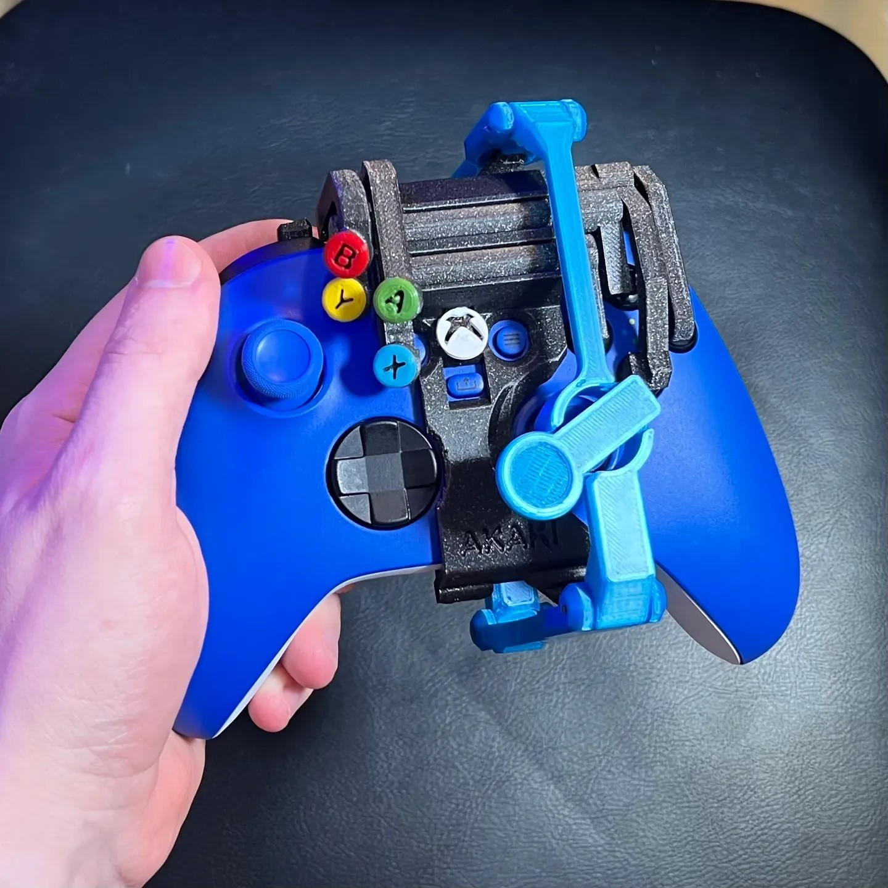
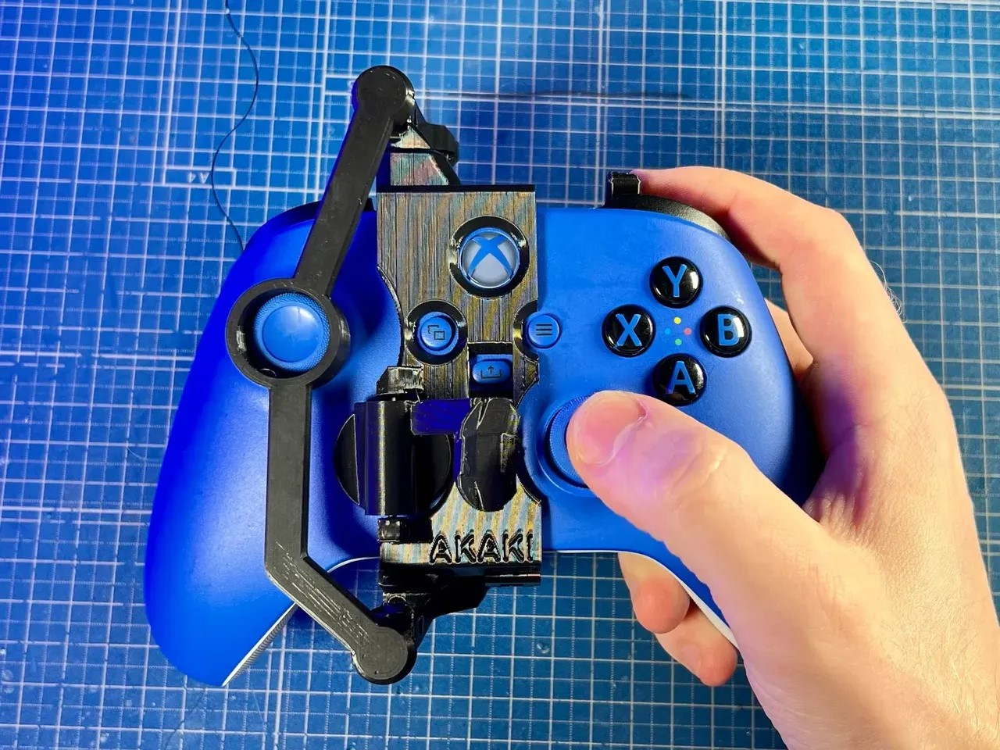

<!--- Open Source Assistive Technology: GitHub Readme Template  --->

<!--- TITLE --->
 # One Handed Modification for Xbox Series X|S Controller

<!--- SUMMARY: A brief summary of the project. What it does, who it is for, how much it costs. --->
The one handed modification for the Xbox Series X|S Controller are modifications to allow users to operate an Xbox Series X|S controller with one hand. There are different modifications available for both right- and left-handed use.

The original design was created by [Akaki](https://www.printables.com/social/106360-akaki/about).

<!--- PHOTO --->
 

## More info at
 - [Makers Making Change Project Page](https://makersmakingchange.com/project/one-handed-mod-xbox-series-xs-controller)
 

## Getting Started
<!--- Include an overall idea of what major steps are required to build the device. --->

### 1. Order the Off-The-Shelf Components
The [Bill of Materials](/Documentation/OneHandedXboxXSController_BOM_V1.0.xlsx) lists all of the parts and components required to build the one handed modification for the Xbox Series X|S Controller.

### 2. Print the 3D Printable components
Select the correct modification (right or left handed modification) and print all the necessary parts for that modification.

All of the files and individual print files can be in the [/Build_Files/3D_Printing_Files](/Build_Files/3D_Printing/) folder.

### 3. Assemble the one handed modification for the Xbox Series X|S Controller.
Reference the [maker guide](/Documentation/OneHandedXboxXSController_Maker_Guide_V1.0.pdf) for the tools and steps required to build each portion.

<!---FILES: This section includes all the information and files required to build and modify the device, including documentation, design files, and build files. --->
## Files

<!--- DOCUMENTATION --->
### Documentation

| Document | Version | Link |
|----------|---------|------|
| Design Summary| 1.0 | [OneHandedXboxXSController_Summary](/Documentation/OneHandedXboxXSController_Summary.pdf) |
| Design Rationale     | 1.0 | [OneHandedXboxXSController_Design_Rationale](/Documentation/OneHandedXboxXSController_Design_Rationale.pdf) |
| Bill of Materials    | 1.0 | [OneHandedXboxXSController_BOM](/Documentation/OneHandedXboxXSController_BOM.xlsx) |
| Maker Guide      | 1.0 | [OneHandedXboxXSController_Maker_Guide](/Documentation/OneHandedXboxXSController_Maker_Guide.pdf) |
| User Guide          | 1.0 | [OneHandedXboxXSController_User_Guide](/Documentation/OneHandedXboxXSController_User_Guide.pdf)           |
| Changelog            | 1.0 | [OneHandedXboxXSController_Changelog](/Documentation/OneHandedXboxXSController_Changelog.pdf)               |

### Design Files
 - Unfortunately, no CAD files are available for this device.

### Build Files
<!--- BUILD FILES --->
 - [3D Printing Files](/Build_Files/3D_Printing)

## License
<!--- LICENSE: Choose an appropriate license. We recommend an open-source hardware compatible license. --->
Everything needed or used to design, make, test, or prepare the one handed modification for the Xbox Series X|S Controller is licensed under a Creative Commons Attribution-ShareAlike 4.0 license <https://creativecommons.org/licenses/by-sa/4.0/> (CC BY-SA 4.0).

Accompanying material such as instruction manuals, videos, and other copyrightable works that are useful but not necessary to design, make, test, or prepare the one handed modification for the Xbox Series X|S Controller are published under a Creative Commons Attribution-ShareAlike 4.0 license <https://creativecommons.org/licenses/by-sa/4.0/> (CC BY-SA 4.0).

## Attribution
<!--- ATTRIBUTION: Include any information related to the development of the design. This may include who identified the initial challenge, who contributed to the design --->

 - The original design of the [One-Handed Xbox Series XS Controller](https://www.printables.com/model/156112-one-handed-xbox-series-xs-controller) was created by [Akaki](https://www.printables.com/social/106360-akaki/about) and released with a [CC-BY-NC-SA license](http://creativecommons.org/licenses/by-nc-sa/4.0/).

 - The left handed modification was remixed by [Ryan Heitanen](https://www.printables.com/social/120065-ryan-hietanen/about).

 - Additional documentation was created by Neil Squire Society / Makers Making Change.
 - The documentation template was created by Makers Making Change and is used under a CC BY-SA 4.0 license. It is available at the following link: https://github.com/makersmakingchange/OpenAT-Template

----

<!-- ABOUT MMC START -->
## About Makers Making Change

Makers Making Change is a program of [Neil Squire](https://www.neilsquire.ca/), a Canadian non-profit that uses technology, knowledge, and passion to empower people with disabilities.

Makers Making Change leverages the capacity of community based Makers, Disability Professionals and Volunteers to develop and deliver affordable Open Source Assistive Technologies.

 - Website: [www.MakersMakingChange.com](https://www.makersmakingchange.com/)
 - GitHub: [makersmakingchange](https://github.com/makersmakingchange)
 - X (formerly Twitter): [@makermakechange](https://twitter.com/makermakechange)
 - Instagram: [@makersmakingchange](https://www.instagram.com/makersmakingchange)
 - Facebook: [makersmakechange](https://www.facebook.com/makersmakechange)
 - LinkedIn: [Neil Squire Society](https://www.linkedin.com/company/neil-squire-society/)
 - Thingiverse: [makersmakingchange](https://www.thingiverse.com/makersmakingchange/about)
 - Printables: [MakersMakingChange](https://www.printables.com/@MakersMakingChange)

### Contact Us
For technical questions, to get involved, or to share your experience we encourage you to [visit our website](https://www.makersmakingchange.com/) or [contact us](https://www.makersmakingchange.com/s/contact).
<!-- ABOUT MMC END -->